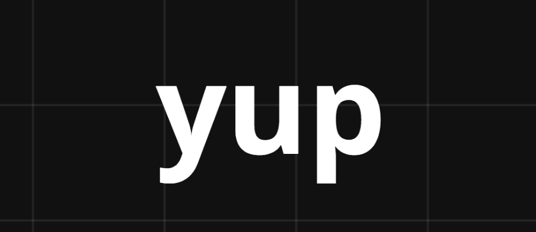
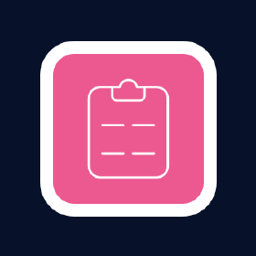

<div style="display:flex; align-items: center">
  
  <h1 style="position:relative; top: -6px" >Covid Questionare App</h1>
</div>

---

Covid Questionare App is multi page form questionare, questions are for Redberry employees, there are some questions that are mandatory and some qeustions that not. questions are about personal information, covid and vaccinate.

#

### Table of Contents

- [Prerequisites](#prerequisites)
- [Tech Stack](#tech-stack)
- [Getting Started](#getting-started)
- [Project Structure](#project-structure)
- [Resources](#resources)

#

### Prerequisites

-  _Node JS @12.X and up_
-  _npm @6 and up_

#

### Tech Stack

-  [React @18.2.0](https://reactjs.org) - front-end framework
-  [React Router @6.6.1](https://reactrouter.com/en/main) - library for routing in a React application.
-  [Axios @1.2.2](https://axios-http.com/docs/intro) - Axios is a promise-based HTTP library
-  [Tailwindcss @3.2.4](https://tailwindcss.com/) - Tailwind CSS is an open source CSS framework.
-  [yup @0.32.11](https://github.com/jquense/yup) - Yup is a schema builder for runtime value parsing and validation.
-  [React Hook Form @7.41.1](https://react-hook-form.com/) - library that helps you build forms in React applications.

#

### Getting Started

1\. First of all you need to clone Covid Questionare repository from github:

```sh
git clone https://github.com/RedberryInternship/sabalap-covid-questionare.git
```

2\. Next step change directory.

```sh
cd sabalap-covid-questionare
```

3\. Next step requires install all the dependencies.

```sh
npm install
```

4\. after that you can run Covid Questionare application from terminal:

```sh
npm run dev
```

#

### Project Structure

```bash
├─── public
├─── readme
│   ├─── assets
├─── src
│   ├─── assets
│   ├───├─── images-folder
│   ├───├─── index.js
│   ├─── components
│   ├───├─── index.js
│   ├───├─── component-folder
│   ├───├───├─── component-name.jsx
│   ├───├───├─── index.js
│   ├─── fonts
│   ├─── hooks
│   ├───├─── hook-name.js
│   ├───├─── index.js
│   ├─── pages
│   ├───├─── pages-folder
│   ├───├───├─── page-name.jsx
│   ├───├───├─── index.js
│   ├───├─── index.js
│   ├─── schemas
│   ├───├─── index.js
│   ├───├─── schema-folder
│   ├───├───├─── schema-name.js
│   ├───├───├─── index.js
│   ├─── store
│   ├───├─── index.js
│   ├───├─── store-folder
│   ├───├───├─── index.js
│   ├───├───├─── store.jsx
│   ├─── app.jsx
│   ├─── index.css
│   ├─── main.jsx
- .eslintrc.json
- .prettierrc.js
- index.html
- jsconfig.json
- package.json
- postcss.config.cjs
- README.md
- tailwind.config.cjs
- vite.config.js
```

#

### Resources

- <a href="https://www.figma.com/file/56t2BI25FcD0LAIjR4GVkQ/%E1%83%99%E1%83%98%E1%83%97%E1%83%AE%E1%83%95%E1%83%90%E1%83%A0%E1%83%98?node-id=37%3A3">Application Design [Figma]</a>
- <a href="https://www.figma.com/proto/56t2BI25FcD0LAIjR4GVkQ/%E1%83%99%E1%83%98%E1%83%97%E1%83%AE%E1%83%95%E1%83%90%E1%83%A0%E1%83%98?node-id=37%3A3&starting-point-node-id=1%3A2&scaling=contain">Application Design Prototype</a>
- <a href="https://redberry.gitbook.io/resources/other/git-is-semantikuri-komitebi">Git commit rules</a>
- <a href="https://fonts.ge/ka/font/13/BPG-Arial">Font [BPG Arial]</a>
